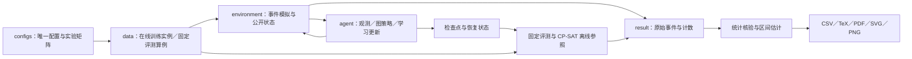

# 情景辅助竞争感知图强化学习：柔性流水车间调度

本仓库研究动态订单到达下的柔性流水车间调度，包含环境、图强化学习方法、学习与规则对照，以及从训练到论文表图的可追溯实验管线。

**正式研究固定为 50 个参数算例、73 个训练作业、6,400 万训练交互。** 方法与参数已经定稿；工程冒烟用于检查实现，不用于选择参数或证明方法胜出。最近一次本机检查、资源测量与启动建议见 [验收报告](docs/ACCEPTANCE.md)；正式训练状态以本地账本为准。

## 1. 先理解问题与方法

订单动态到达，每个产品按固定阶段顺序加工；各阶段有并行机器，并非所有机器都具备加工每道工序的资格。加工不可抢占。只有整个订单按时完成才获得等权履约收益；等待中的无望订单被放弃，已消耗的加工能力不返还。

在线策略只读取公开加工目录、已到达订单和可见历史。动作是所有合法的 `Dispatch(order, machine)` 与 `Wait`，不裁剪候选动作。未来实际订单对策略不可见。

主方法 `full` 包含三个部分：

- **图策略与竞争修正**：HGNN 编码订单、工序和机器；动作条件竞争图评估一次派工对其他订单的影响，以门控残差修正动作得分。
- **情景辅助学习**：训练时从公开信息生成共享未来，比较候选动作的后续结果，用可靠性加权偏好改进策略。在线推理不运行情景搜索或规则教师。
- **示范初始化**：以固定 SPT 规则生成示范，完成监督初始化后继续强化学习。

到达频率为 `iota = lambda × p_bar`，系统负荷为 `rho = lambda × u_star`。本研究以 `iota ≥ 1` 定义高频；同一目录下频率与负荷联动，不能解释为两个独立控制因素。

## 2. 代码与数据如何流动



| 模块 | 职责 | 建议阅读入口 |
|---|---|---|
| `configs/` | 配置、方法集合、73 个作业及身份规则 | [experiment.yaml](configs/experiment.yaml)、[experiment.py](configs/experiment.py) |
| `data/` | 在线随机生成、固定网格与用途映射 | [online.py](data/online.py)、[benchmark.py](data/benchmark.py) |
| `environment/` | 合法动作、事件推进、公开信息隔离、离线排程 | [public.py](environment/public.py)、[env.py](environment/env.py) |
| `agent/` | 图观测、策略、PPO/Q-learning、情景偏好与恢复 | [model.py](agent/model.py)、[training.py](agent/training.py)、[preference.py](agent/preference.py) |
| `result/` | 记录、身份、评测、统计、图表及验收 | [recording.py](result/recording.py)、[evaluation.py](result/evaluation.py) |
| `scripts/` | 按依赖执行各阶段，管理进程池和验收 | [pipeline.py](scripts/pipeline.py) |
| `tests/` | 机制、完整性、故障恢复及多进程回归 | [test_acceptance.py](tests/test_acceptance.py) |

复现实验可直接从下一节开始；理解实现可按 `public → observation → model → training → evaluation` 阅读。字段和预算口径见 [数据字典](docs/data-dictionary.md)。

## 3. 安装与完整自检

在仓库根目录打开 PowerShell。本机使用以下解释器；其他机器可将 `$Python` 换成安装依赖的 Python 路径。

```powershell
$Python = 'E:\anaconda3\envs\python3.13\python.exe'
& $Python -m pip install -r requirements.txt
& $Python scripts/run_00_smoke.py 8
```

依赖下限见 [requirements.txt](requirements.txt)，实测版本保存在各运行目录的 `runtime.json`。本机 Python 为 3.13；代码使用 CPU，不会因安装了 CUDA 版 PyTorch 而自动切换 GPU。Linux 可使用 `python scripts/run_00_smoke.py 8`；当前本轮验收环境为 Windows，其他平台需重新自检。

完整自检包括全部回归测试、17 个微型训练作业、真实并行与串行结果比对、评测、离线回放、统计和图表，并检查有效情景偏好更新。另在独立进程中使用正式网络、批量、完整缓冲容量和最大车间输入进行资源探针。因此它比单独运行 `pytest` 更完整，也比旧版仅微型冒烟更耗时。

```powershell
# 只运行回归测试；不能替代完整冒烟
& $Python -B -X utf8 -m pytest tests -q
```

成功时出现 `[OK] Engineering acceptance`，且 `result/engineering/complete.json` 指向本轮目录。目录内保存 `pytest.xml`、微型作业、`probes/parallel.json`、`probes/resources.json` 和表图。源码、环境及并发覆盖匹配时，重复命令核验文件后复用结果，不新增模拟交互；请求更高并发时会补做验收。

工程交互**没有累计硬上限**，但仍记录实际消耗和未确认预留。旧账本原样保存在 `result/engineering/accounting/legacy.json`，新进程分别写入 `accounting/sessions/`，汇总写入 `interaction_ledger.json`。这些记录与正式作业预算分开，故障和重试也不隐去。

## 4. 正式实验的组成

训练在线生成 3 产品、3 阶段、每阶段 2 台机器、48–96 订单的实例。固定评测每个参数组合只有一个物理算例，方法和训练种子共享它们。

| 固定用途 | 规模 | 唯一算例数 |
|---|---|---:|
| 验证 | 标准车间，72 订单 | 6 |
| 主测试 | 标准车间，48／96 订单 | 12 |
| 小规模离线参照 | 标准车间，12／24 订单 | 12 |
| 长到达流 | 标准车间，128／192 订单 | 12 |
| 大车间 | 6 产品、5／7 阶段、每阶段 3 台机器 | 8 |
| 敏感性 | 引用主测试文件 | 0 |

标准网格为 `iota={0.6,1.5,2.5}`、交期系数 `{1.5,3.0}`；大车间只用两档高频。目录要求整组负荷均在 `[0.3,1.8]`，这是联合条件采样。种子、子流、目录及文件身份保存在固定数据的 manifest 中。

| 训练组 | 配置与种子 | 每作业预算 | 合计 |
|---|---|---:|---:|
| 主方法 | `full`，5 种子 | 100 万 | 500 万 |
| 学习对照与消融 | 10 方法，各 5 种子 | 100 万 | 5,000 万 |
| 敏感性 | 6 个单因素变化，各 3 种子 | 50 万 | 900 万 |

学习对照为 DQN、DDQN、A2C、PPO、HGNN、双注意力；消融为 `no_graph`、`no_scenario`、`no_demo`、`impact_only`。敏感性改变情景数、辅助权重或窗口，默认配置复用主方法对应检查点。完整清单见 [运行矩阵](docs/run-matrix.md)。

SPT、FCFS、EDD、MST、CR、LWKR 无需训练；额外保留 SPT-mixed 平局变体。CP-SAT 拥有未来信息，作为离线参照，只有 `OPTIMAL` 表示已证明最优。

## 5. 按阶段启动与检查

先完成自检。下表命令均在仓库根目录执行；`$Python` 沿用上一节。训练命令末尾可带一个正整数并发数。

| 阶段 | 命令 | 前置条件与完成产物 |
|---|---|---|
| 准备 | `& $Python scripts/run_01_prepare_data.py` | 校验 50 例，生成正式 freeze、matrix 和零用量账本 |
| 主方法 | `& $Python scripts/run_02_train_main.py 1` | 当前源码冒烟通过；5 个作业完成 |
| 对照与消融 | `& $Python scripts/run_03_train_comparators.py 1` | 50 个作业完成 |
| 敏感性 | `& $Python scripts/run_04_train_sensitivity.py 1` | 18 个作业完成 |
| 评测 | `& $Python scripts/run_05_evaluate.py` | 全部训练完成；生成各用途评测和共享状态延迟 |
| 离线参照 | `& $Python scripts/run_06_exact_reference.py` | 数据完成；12 个小规模求解与排程回放 |
| 统计 | `& $Python scripts/run_07_statistics.py` | 评测与离线参照完整；生成效应、区间及轨迹审计 |
| 导出 | `& $Python scripts/run_08_export.py` | 统计完整；生成 `paper_assets/manifest.json` 及资产 |

也可由一个入口依次执行以上阶段：

```powershell
# 会真正启动全部 6,400 万训练交互；本次工程验收不执行此命令
& $Python scripts/run_formal_all.py 1
```

示例使用单作业，增加并发前应参考最新 [资源验收](docs/ACCEPTANCE.md)。不带参数时默认并发上限为 `runtime.jobs=8`，上限还受逻辑核心数约束；正式启动前会检查当前可用内存和磁盘，资源不足会明确退出。不会通过缩小网络、批量或记录粒度来继续运行。

需要区分三个概念：

- **作业并发数**：独立方法／种子进程的数量，每进程默认 1 个 PyTorch 线程。
- **训练环境数**：一个作业内收集样本的 8 个环境，不等于额外启动 8 个操作系统进程。
- **统计重复数**：训练种子产生独立训练重复；同状态计时重复和固定参数单元不能代替训练种子。

数据准备、统计和导出串行；在线延迟在共同的 SPT 状态面板上串行测量，正式预热 10 次、计时 30 次。小规模 CP-SAT 每例单线程，墙钟上限 300 秒、确定性时间 60；12 例求解上限合计约 1 小时，另有构模与回放。

PyCharm 中选择相同解释器、对应脚本及仓库根目录作为工作目录；Parameters 留空或填一个并发数即可。

## 6. 保存、失败与恢复

每个作业位于 `result/formal/runs/<方法>_s<种子>/`，包含独立 `stdout.log`、`status.json`、`budget.json`、检查点和 `raw/`。

正式 `total_steps = real_steps + scenario_steps + demonstration_steps + lost_upper_bound`。验证评测另记成本。崩溃时无法确认的预留按上界计费，不额外赠送预算。

`checkpoint_last.pt` 与 `checkpoint_previous.pt` 保存恢复状态；固定里程碑、初始化及验证最优模型另存。完成作业的 `completion_manifest.json` 校验文件内容，恢复检查点、预算提交和原始记录必须相互一致。按原命令重跑即可恢复或复用。

| 现象 | 检查与处理 |
|---|---|
| 作业失败 | 查看对应 `stdout.log`、`status.json` 和 `budget.json`；修复原因后重跑原命令 |
| 目录已被占用 | 活进程或其他主机的锁会被拒绝；同主机已退出进程的残留锁可自动归档恢复 |
| 源码／配置／数据不兼容 | 拒绝沿旧运行续训；不要改身份值、删除账本或重抽固定算例来绕过检查 |
| 文件损坏或资产缺失 | 明确报错，保留证据；不会凭完成标记直接通过验收 |
| 内存／磁盘不足 | 查看 `memory_preflight.json`／`storage_estimate.json`，降低作业并发或提供存储空间 |
| 一个并行作业失败 | 停止提交后续任务，其余作业在持久化检查点边界退出；整批非零返回 |

源码包、有效配置、运行环境和哈希随作业保存。文本身份归一化 CRLF/LF；二进制文件按原字节校验。训练语义改变拒绝旧检查点续训；报告修改不改变训练身份。大型产物在 Git 中忽略，本地保留。

## 7. 从哪里读取结果

| 需要的证据 | 主要文件 |
|---|---|
| 主比较、消融、泛化 | `main.csv`、`long_stream.csv`、`large_shop.csv`、`summary.csv`、`effects.csv`、`case_effects.csv` |
| 敏感性、初始化、学习过程 | `sensitivity.csv`、`initialization.csv`、`main_*.csv`、`learning_curves.csv` |
| 原始决策与可追溯性 | `runs/*/raw/`、`evaluations/*/`、`trace_audit.csv`、各 manifest |
| 离线参照 | `exact.csv`、`exact_schedule.csv`、`exact/*.json`、`offline_gaps.csv` |
| 运行与行为 | `costs.csv`、`execution/*.json`、`latency.csv`、`behavior.csv`、`preference_diagnostics.csv` |
| 可用于写作的表图 | `paper_assets/` 内的 CSV、TeX、PDF、SVG、PNG 和来源 manifest |

上述路径相对 `result/formal/`；工程自检有相同结构，但资产标注“Engineering smoke only”。作业耗时之和、并行批次墙钟和单次推理延迟是不同指标。

主证据为整体重采样训练种子向量得到的自助 95% 区间和逐算例配对效应。配对 Wilcoxon 原始 p 值仅作附录参考，不做多重比较校正。每个参数组合只有一个固定实例，不能将固定网格均值解释为该参数下随机实例总体的期望。负结果完整保留，导出不要求主方法胜出。

进一步阅读：[实验规格](docs/experiment-spec.md) · [数据字典](docs/data-dictionary.md) · [主张与证据映射](docs/claim-evidence.md) · [验收报告](docs/ACCEPTANCE.md)。
